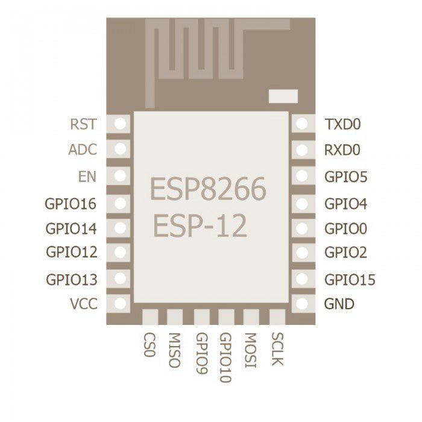
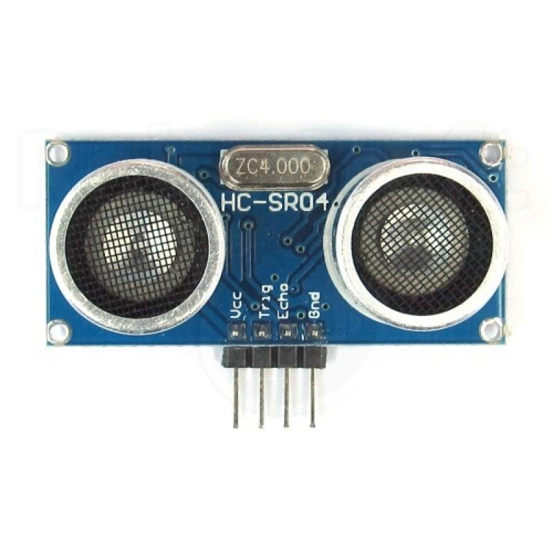
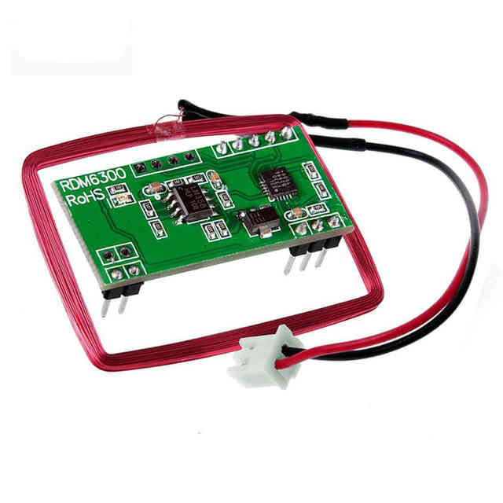
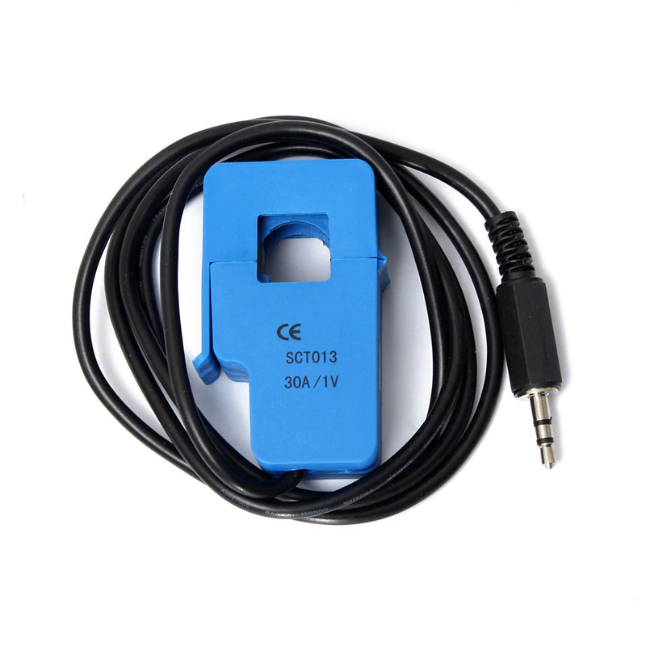
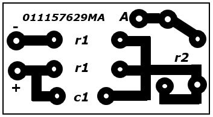
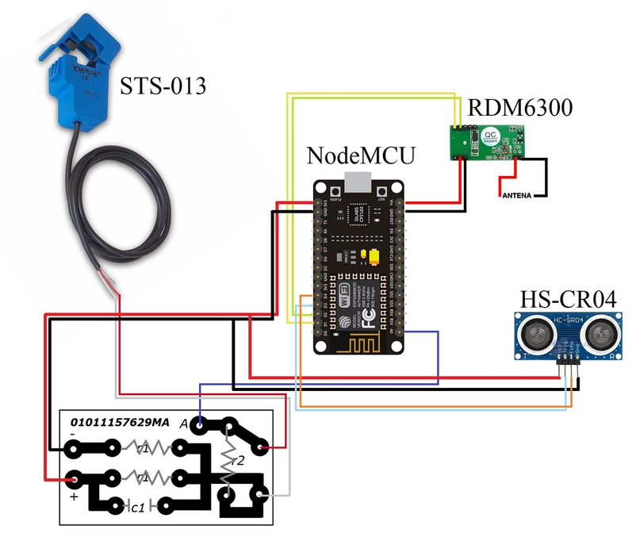
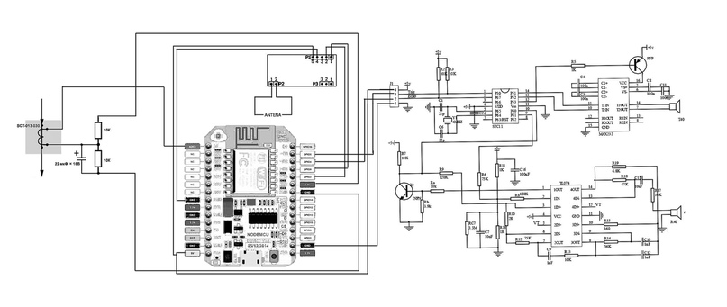

# project EPMS
Проект EPMS (*Equipment Performance Monitoring System*) - это проект нацеленный на создание системы мониторинга функционирвания оборудования, созданный студентами Санкт-Петербургского Политехнического Университета в 2018 году.

## Команда

*Глава проекта, hardware* | *Разработчик*
--------------- | ------------------
**Майорова Александра** | **Артур Ишмухаметов**
 | 
[@AlexandraMayorova](https://github.com/AlexandraMayorova) | [@ArthurIshmukhametov](https://github.com/ArthurIshmukhametov)
mayorova.alexandra83@gmail.com | stook1998@yandex.ru

********

## О проекте
**Цель проекта** - разработать и вывести на рынок аппаратно-программный комплекс для контроля оборудования.

**Основная отличительная особенность** - платформа с интерфейсом беспроводного взаимодействия модуля с сервером и конструкторным принципом сборки. То есть можно адаптировать платформу под определённые нужды заказчика.

## Применение
Данный аппаратно-программный комплекс применим к оборудования без встроенных датчиков. Главная особенность данного решения - *его модульность*. Комбинируя различные датчики и дополняя под них прошивку мы можем решить различные задачи. На данном этапе разработки прописан сетевой протокол позволяющий взаимодействовать с любым сервером заказчика.

## Дополнительно
На основе разработок написана научная статья, с которой на неделе науки в 2018 году Майорова Александра заняла первое место в направлении **инноватика**. Статья опубликована на русском языке **в сборнике материалов научной конференции с
международным участием «Неделя науки СПбПУ»**
[Вы можете ознакомиться с данной статьей](docs/article.pdf)
      

## Техническая реализация
### Программное обеспечение

Прошивка написана в среде **ArduinoIDE**. В ней реализованы: *инициализация модулей, считывание данных, обработка данных, отправка данных по HTTP*. Языка разработки С/С++. Подробнее с прошивком можно ознакомиться по ссылке [на наш git репозиторий](https://github.com/mayorovaproject/EPMS).
### Используемые модули

Модуль | Описание
--------------- | ------------------
 | ESP8266 (ESP-12) - Микропроцессор с интерфейсом Wi-Fi
 | Ультразвуковой датчик расстояния - hc-sr04
 | RMD6300 - rfid считыватель для меток на частоте 125 кГц
 | SCT013 - инвазивный датчит тока
 | Преобразователь тока собственной разработки

### Схемы соединения

*Упрощенный вид*

*Подробная схема*

## Дальнейшее развитие

* Собрать собственную плату на ESP, объедененную с токовым преобразователем
* Дополнить ПО
