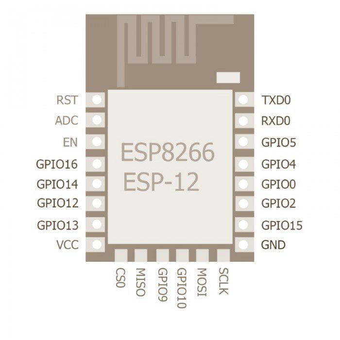
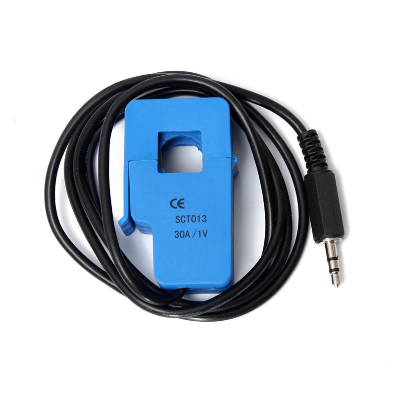
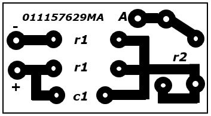

# project EPMS
Проект EPMS (*Equipment Performance Monitoring System*) - это проект нацеленный на создание системы мониторинга функционирвания оборудования, созданный студентами Санкт-Петербургского Политехнического Университета в 2018 году.
## Команда

*Глава проекта* | *Ещё какой-то чел*
--------------- | ------------------
**Майорова Александра** | **Артур Ишмухаметов**
 | 

### Контакты
**git**

@AlexandraMayorova

@ArthurIshmukhametov

**e-mail**

mayorova.alexandra83@gmail.com

stook1998@yandex.ru

## Наш репозиторий
https://github.com/mayorovaproject/EPMS
## О проекте
**Цель проекта** - разработать и вывести на рынок аппаратно-программный комплекс для контроля оборудования.
**Основная отличительная особенность** - платформа с интерфейсом взаимодействия модуля с сервером.

## Используемые модули

Модуль | Описание
--------------- | ------------------
 | ESP8266 (ESP-12) - Микропроцессор с интерфейсом Wi-Fi
 | Ультразвуковой датчик расстояния - hc-sr04
 | RMD6300 - rfid считыватель для меток на частоте 125 кГц
 | SCT013 - инвазивный датчит тока
 | Преобразователь тока собственной разработки

## Применение
Содержимое!
